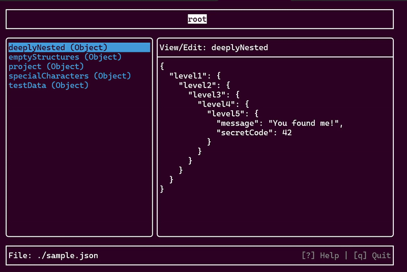

# EZSetting


## Overview
EZSettingは、ターミナル上で動作するJSONファイルエディタです。  
FTXUIを使用しており、直感的なTUIでJSONファイルを閲覧・編集できます。  

## Futures
- TUIベース: マウスを使わずにキーボードだけで快適に操作可能。
- ツリー構造表示: JSONの階層構造をツリー形式で表示し、直感的にナビゲートできます。
- パンくずリスト: 現在の階層位置を常に表示します。
- 編集機能:
    - 値の編集
    - キー/値の追加
    - キー/値の削除
    - キー名の変更
    - 配列要素の追加・削除
- Undo/Redo: 操作の取り消しとやり直しが可能です。
- 検索機能: JSON内の要素を検索できます。

## Requirements
- C++20以上
- CMake
- FTXUI
- nlohmann/json

## Build
```bash
mkdir build
cd build
cmake ..
make
```

## Usage
```bash
./ezsetting <filename.json>
```
例:
```bash
./ezsetting sample.json
```

## Operation

### Navigation
| Key | Action |
| :--- | :--- |
| `↑` / `k` | 上に移動 |
| `↓` / `j` | 下に移動 |
| `←` / `h` | 左に移動 |
| `→` / `l` | 右に移動 / 値を編集 |
| `Enter` | 子階層へ入る / 値を確定 |

### Action
| Key | Action |
| :--- | :--- |
| `a` | アイテムの追加 |
| `d` | アイテムの削除 |
| `r` | キー名の変更 |
| `/` | 検索 |
| `z` | Undo |
| `y` | Redo |
| `?` | ヘルプ表示 |
| `q` | 終了 |
| `Esc` | モーダルを閉じる / キャンセル |

## License
[MIT License](LICENSE)
